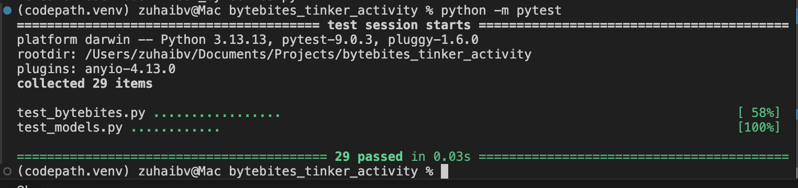

# ByteBites

ByteBites is a food-ordering system designed to be fast, personalized, and smart.
This project demonstrates object-oriented design, Python class scaffolds, and simple algorithms to manage menus, orders, and customer purchase history.

## Features

- Manage menu items with name, price, category, and popularity
- Track customer orders and purchase history
- Filter menu items by category
- Sort menu items by price and popularity
- Calculate order totals

## Classes

- **Customer** – Represents a user and their purchase history
- **FoodItem** – Represents a menu item
- **Menu** – Manages available food items
- **Order** – Represents an order containing selected items

## Summary

This activity guided students through designing and implementing a simple food-ordering system using Python classes. Students needed to understand how to break a feature request into core classes, define relationships, and implement algorithms like filtering, sorting, and total calculations. Students are more likely to struggle with translating UML diagrams into working Python code, especially handling lists of objects and method interactions. AI tools like Copilot and a custom design agent were helpful for generating scaffolds, drafting method logic, and suggesting tests, but they were sometimes misleading by adding unnecessary features or skipping important ones. Students can learn to critically evaluate AI output rather than accepting it blindly, refining the code themselves. One effective way to guide a student is to ask them to describe the expected behavior before writing any code — this helps them think through the problem and the steps without giving away the answer.

## Demo

